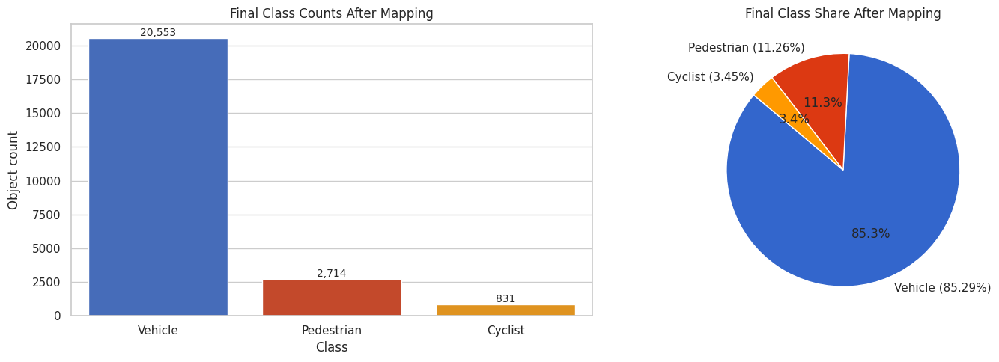

# Road-Sense 🚗🤖
**Real-Time Object Detection for Autonomous Vehicles**

[](https://www.python.org/)
[](https://pytorch.org/)
[](https://docs.ultralytics.com/)
[](http://www.cvlibs.net/datasets/kitti/)

---

##  Table of Contents
- [Project Overview](#-project-overview)
- [Features](#-features)
- [Dataset Information](#-dataset-information)
- [Project Structure](#-project-structure)
- [Installation](#-installation)
- [Quick Start](#-quick-start)
- [Documentation](#-documentation)
- [Results](#-results)
- [Team](#-team)
- [Acknowledgments](#-acknowledgments)

---

##  Project Overview

**Road-Sense** is an end-to-end machine learning project focused on building a **real-time object detection system** for autonomous vehicles. The system can detect and classify:

-  **Vehicles** (Cars, Vans, Trucks)
-  **Pedestrians** (Pedestrian, Person_sitting)
-  **Cyclists**
-  **Traffic Signs** *(Stage 2)*

The project addresses critical challenges in autonomous driving, such as:
- Detecting objects in various lighting conditions
- Handling different road types (urban, highway, rural)
- Real-time inference (30+ FPS) for safe decision-making
- Robust performance with occlusion and small objects

This project is part of the **DEPI AI & Data Science Track - Round 2** and follows a structured approach through 5 milestones, from data collection to deployment and MLOps.

---

##  Features

### Current Capabilities (Milestone 1 - Complete ✅)
-  **Dataset Collection & Validation**: KITTI dataset (7,481 training images, 38,186 annotations)
-  **Data Preprocessing Pipeline**: KITTI → YOLO format conversion
-  **Class Merging**: Vehicle (Car/Van/Truck), Pedestrian, Cyclist
-  **Data Quality Validation**: Zero corrupted images or invalid annotations
-  **Dataset Splitting**: 70% train, 20% val, 10% test (reproducible)
-  **Data Augmentation Strategy**: Geometric + photometric augmentations
-  **Comprehensive Documentation**: Dataset analysis, preprocessing guide, upload guidelines

### Planned Capabilities
-  **Model Training**: YOLOv8/v11 fine-tuning on KITTI (Milestone 2)
-  **Real-Time Deployment**: Inference pipeline for camera input (Milestone 3)
-  **Traffic Sign Detection**: Integration of GTSDB dataset (Stage 2)
-  **MLOps Pipeline**: Monitoring, retraining, drift detection (Milestone 4)
-  **Final Evaluation**: mAP, IoU, FPS benchmarking (Milestone 5)

---

##  Dataset Information

### Primary Dataset: KITTI Vision Benchmark Suite

**Source:** [KITTI Vision Benchmark Suite](http://www.cvlibs.net/datasets/kitti/)  
**Paper:** Geiger, A., Lenz, P., & Urtasun, R. (2012). "Are we ready for Autonomous Driving? The KITTI Vision Benchmark Suite." CVPR 2012.

#### Dataset Characteristics
| Property | Value |
|----------|-------|
| **Total Training Images** | 7,481 images (100% clean and validated) |
| **Total Annotations** | 38,186 usable objects (after filtering) |
| **Image Resolution** | 1242×375 to 1392×512 pixels (resized to 640×640 for YOLO) |
| **Format** | KITTI format (converted to YOLO) |
| **Environment** | Urban, Highway, Rural roads (Karlsruhe, Germany) |
| **Lighting** | Daytime only |
| **Weather** | Sunny/Cloudy |

#### Class Distribution (After Merging)
| Class | Count | Percentage | Description |
|-------|-------|------------|-------------|
| **Vehicle** | 32,750 | 85.73% | Car, Van, Truck merged |
| **Pedestrian** | 4,709 | 11.06% | Pedestrian, Person_sitting merged |
| **Cyclist** | 1,627 | 4.01% | Cyclist |
| **Total** | **38,186** | **100%** | 3 classes for Stage 1 |

#### Dataset Split
| Split | Images | Percentage | Purpose |
|-------|--------|------------|---------|
| **Train** | 5,237 | 70% | Model training |
| **Validation** | 1,496 | 20% | Hyperparameter tuning, overfitting monitoring |
| **Test** | 748 | 10% | Final evaluation (held out) |

**Quality Validation:**
```
 Total PNG Images Found:     7481
 Corrupted Images:           0
 Missing Label Files:        0
 Invalid/Out-of-bounds Bboxes: 0
 Exact Duplicates Found:     0
 Result: Dataset is CLEAN and ready for preprocessing!
```

#### Supplementary Datasets
- **COCO**: Used for pre-trained weights (YOLOv8/v11 models trained on COCO)
- **GTSDB** *(Stage 2)*: German Traffic Sign Detection Benchmark (~900 images, 1,200+ signs)

**See also:** [Dataset Download Instructions](docs/DATASET_DOWNLOAD_INSTRUCTIONS.md) | [Dataset Exploration Report](docs/DATASET_EXPLORATION_REPORT.md)

---

##  Project Structure

```
Road-Sense/
├── README.md                      # This file
├── requirements.txt               # Python dependencies
├── pyproject.toml                 # Project configuration
├── Dockerfile                     # Docker image for deployment
├── .gitignore                     # Git exclusions (large files)
│
├── configs/                       # Configuration files
│   ├── preprocessing.yaml         # KITTI preprocessing config
│   └── multi_dataset_preprocessing.yaml  # Multi-dataset config (Stage 2)
│
├── data/                          # Data directory (see .gitignore)
│   ├── raw/                       # Raw datasets (NOT in Git)
│   │   ├── KITTI/                 # KITTI dataset (download separately)
│   │   │   └── training/
│   │   │       ├── image_2/       # 7,481 PNG images (12 GB)
│   │   │       └── label_2/       # 7,481 TXT labels (5 MB)
│   │   └── GTSDB/                 # Traffic signs (Stage 2)
│   ├── processed/                 # Preprocessed YOLO-ready data (NOT in Git)
│   │   └── kitti/
│   │       ├── data.yaml          # YOLO dataset config
│   │       ├── images/            # Resized images (640×640 JPG)
│   │       │   ├── train/         # 5,237 images
│   │       │   ├── val/           # 1,496 images
│   │       │   └── test/          # 748 images
│   │       └── labels/            # YOLO format labels
│   │           ├── train/         # 5,237 .txt files
│   │           ├── val/           # 1,496 .txt files
│   │           └── test/          # 748 .txt files
│   ├── augmented/                 # Augmented data (optional, NOT in Git)
│   └── samples/                   # Sample files (5 images, IN Git)
│       └── kitti/
│           ├── image_2/           # 5 sample images (for testing)
│           └── label_2/           # 5 sample labels
│
├── docs/                          # Comprehensive documentation
│   ├── DATASET_EXPLORATION_REPORT.md          # Milestone 1 deliverable
│   ├── PREPROCESSING_AND_AUGMENTATION_GUIDE.md  # Step-by-step guide
│   ├── DATASET_DOWNLOAD_INSTRUCTIONS.md       # How to download datasets
│   ├── DATASET_UPLOAD_GUIDELINES.md           # Git best practices
│   ├── data_quality_report.md                 # Validation results
│   └── MULTI_DATASET_TRAINING_STRATEGY.md     # Training plan
│
├── src/                           # Source code
│   ├── data/                      # Data processing modules
│   │   ├── __init__.py
│   │   ├── preprocess_dataset.py  # Main preprocessing script
│   │   ├── kitti_utils.py         # KITTI format utilities
│   │   ├── augmentations.py       # Augmentation pipeline
│   │   ├── validate_kitti_quality.py  # Data quality validation
│   │   ├── verify_dataset.py      # Post-processing verification
│   │   ├── augment_dataset.py     # Augmentation script
│   │   ├── PREPROCESSING.md       # Documentation
│   │   └── README.md
│   ├── models/                    # Model architectures (Milestone 2)
│   ├── deployment/                # Deployment scripts (Milestone 3)
│   ├── mlops/                     # MLOps pipeline (Milestone 4)
│   └── utils/                     # Utility functions
│
├── scripts/                       # Standalone scripts
│   ├── dataset_exploration_analysis.py  # EDA script
│   ├── quick_stats.py             # Statistics generation
│   └── quick_visualization.py     # Visualization script
│
├── notebooks/                     # Jupyter notebooks (exploration)
│   ├── Dataset Exploration & Statistical Analysis.ipynb
│   ├── German_Traffic_Signs_Exploration.ipynb
│   └── data_augmentation.ipynb
│
├── experiments/                   # Experiment outputs
│   └── visualization/
│       └── dataset_analysis/
│           ├── dataset_statistics.csv   # Class distribution
│           └── *.png                    # Plots
│
├── tests/                         # Unit tests
│   ├── __init__.py
│   ├── test_kitti_utils.py        # Test KITTI utilities
│   └── test_augmentations.py      # Test augmentation pipeline
│
├── models/                        # Saved models (NOT in Git, except best.pt)
│   └── checkpoints/
│       └── best.pt                # Best model checkpoint (optional)
│
└── reports/                       # Reports and analysis
    ├── SETUP_COMPLETE_SUMMARY.md  # Setup summary
    ├── research/                  # Dataset research
    │   ├── Abdallah_dataset_analysis.md
    │   └── AyaAhmed_dataset_analysis.md
    └── templates/
        └── dataset_analysis_template.md
```

**Note:** Large files (raw data, processed data, model checkpoints) are excluded from Git. See [Dataset Upload Guidelines](docs/DATASET_UPLOAD_GUIDELINES.md).

---

##  Installation

### Prerequisites
- **Python**: 3.8 or higher
- **GPU**: NVIDIA GPU with CUDA 11.0+ (recommended for training)
- **Disk Space**: ~15 GB (12 GB for KITTI raw data + 3 GB for processed data and models)
- **RAM**: 8 GB minimum (16 GB recommended)

### Step 1: Clone the Repository

```bash
git clone https://github.com/your-username/Road-Sense.git
cd Road-Sense
```

### Step 2: Create Virtual Environment

```bash
# Using venv
python3 -m venv venv
source venv/bin/activate  # Linux/Mac
# Or on Windows: venv\Scripts\activate

# Using conda (alternative)
conda create -n road-sense python=3.8
conda activate road-sense
```

### Step 3: Install Dependencies

```bash
# Install required packages
pip install -r requirements.txt

# Key packages installed:
# - torch, torchvision (PyTorch)
# - ultralytics (YOLOv8/v11)
# - opencv-python (image processing)
# - numpy, pandas (data processing)
# - matplotlib, seaborn (visualization)
# - pyyaml (configuration management)
# - albumentations (augmentations)
# - tqdm (progress bars)
```

### Step 4: Download KITTI Dataset

Follow the instructions in [Dataset Download Instructions](docs/DATASET_DOWNLOAD_INSTRUCTIONS.md):

```bash
# Quick summary:
# 1. Register at http://www.cvlibs.net/datasets/kitti/
# 2. Download data_object_image_2.zip (12 GB)
# 3. Download data_object_label_2.zip (5 MB)
# 4. Extract to data/raw/KITTI/training/
```

Or use sample data for testing:
```bash
# Sample files are already included in data/samples/kitti/
ls data/samples/kitti/
```

### Step 5: Verify Installation

```bash
# Check Python version
python --version  # Should be 3.8+

# Check PyTorch installation
python -c "import torch; print(f'PyTorch: {torch.__version__}')"
python -c "import torch; print(f'CUDA Available: {torch.cuda.is_available()}')"

# Check Ultralytics YOLO
python -c "from ultralytics import YOLO; print('YOLO installed successfully')"

# Run dataset validation (if KITTI downloaded)
python src/data/validate_kitti_quality.py
```

---

##  Quick Start

### Option 1: Preprocess Full KITTI Dataset

```bash
# Step 1: Validate raw data quality
python src/data/validate_kitti_quality.py

# Step 2: Run preprocessing (KITTI → YOLO format)
python -m src.data.preprocess_dataset

# Step 3: Verify output
python src/data/verify_dataset.py --data data/processed/kitti/data.yaml

# Step 4: Check statistics
python scripts/quick_stats.py
```

**Expected output:**
```
 Successfully processed: 7,481 images
 Total objects: 38,186
   ├─ Vehicle: 32,750 (85.73%)
   ├─ Pedestrian: 4,709 (11.06%)
   └─ Cyclist: 1,627 (4.01%)

 Dataset split:
   ├─ Train: 5,237 images (70.00%)
   ├─ Val: 1,496 images (20.01%)
   └─ Test: 748 images (9.99%)

 Output saved to: data/processed/kitti/
```

### Option 2: Test with Sample Data

```bash
# Use 5 sample images for testing
python -m src.data.preprocess_dataset --config configs/sample_preprocessing.yaml

# Visualize samples
python scripts/quick_visualization.py --split train --num_samples 5
```

### Option 3: Python API (Recommended)

```python
from src.data import preprocess_dataset

# Run preprocessing with default config
stats = preprocess_dataset()

print(f"Successfully processed: {stats['successful']} images")
print(f"Total objects: {stats['total_objects']}")
print(f"Vehicle count: {stats['class_counts']['Vehicle']}")
```

---

##  Documentation

### Core Documentation
- **[README.md](README.md)** - This file (project overview, setup, usage)
- **[Dataset Exploration Report](docs/DATASET_EXPLORATION_REPORT.md)** - Comprehensive dataset analysis (Milestone 1)
- **[Preprocessing & Augmentation Guide](docs/PREPROCESSING_AND_AUGMENTATION_GUIDE.md)** - Step-by-step pipeline documentation
- **[Dataset Download Instructions](docs/DATASET_DOWNLOAD_INSTRUCTIONS.md)** - How to download KITTI, COCO, GTSDB
- **[Dataset Upload Guidelines](docs/DATASET_UPLOAD_GUIDELINES.md)** - Git best practices for large datasets

### Additional Documentation
- **[Data Quality Report](docs/data_quality_report.md)** - Validation results
- **[Preprocessing Module README](src/data/PREPROCESSING.md)** - Module documentation
- **[Setup Complete Summary](reports/SETUP_COMPLETE_SUMMARY.md)** - Initial setup report

### Research and Analysis
- **[Dataset Analysis (Abdallah)](reports/research/Abdallah_dataset_analysis.md)** - KITTI, COCO, Open Images comparison
- **[Dataset Statistics](experiments/visualization/dataset_analysis/dataset_statistics.csv)** - Class distribution CSV

---

##  Results

### Milestone 1 Results (Complete )

#### Dataset Statistics
| Metric | Value |
|--------|-------|
| **Total Clean Images** | 7,481 |
| **Total Annotations** | 38,186 |
| **Corrupted Images** | 0 |
| **Missing Labels** | 0 |
| **Invalid Bounding Boxes** | 0 |
| **Preprocessing Time** | ~5-8 minutes (on modern CPU) |

#### Class Distribution (After Merging)


| Class | Count | Percentage |
|-------|-------|------------|
| Vehicle | 20553 | 85.3% |
| Pedestrian | 2714 | 11.3% |
| Cyclist | 831 | 3.4% |

#### Dataset Split
| Split | Images | Objects | Percentage |
|-------|--------|---------|------------|
| Train | 5,237 | ~26,730 | 70% |
| Validation | 1,496 | ~7,637 | 20% |
| Test | 748 | ~3,819 | 10% |

---

##  Team

**Project:** Real-Time Object Detection for Autonomous Vehicles  
**Track:** DEPI AI & Data Science Track - Round 4 
**Institution:** Digital Egypt Pioneers Initiative (DEPI)

### Team Members
- [Abdallah Zain](https://github.com/Abdallah4Z)
- [Ahmed Elkady](https://github.com/ahmed9194)
- [Aya Ahmed](https://github.com/aya335)
- [FatmaElzahraa Wahby](https://github.com/fatmawahby)
- [Menna tuallah Farghaly](https://github.com/fa290)
- [Mohamed Abd El Mawgoud](https://github.com/MohamedAbdelMawjoud)

### Advisors
- Aya Abdallah

---

##  License

This project is licensed under the **MIT License** - see the [LICENSE](LICENSE) file for details.

**Third-Party Datasets:**
- **KITTI Dataset:** [KITTI License](http://www.cvlibs.net/datasets/kitti/)
- **COCO Dataset:** [COCO License](https://cocodataset.org/#termsofuse)
- **GTSDB Dataset:** [GTSDB License](https://benchmark.ini.rub.de/gtsdb_dataset.html)

---

##  Acknowledgments

### Datasets
- **KITTI Vision Benchmark Suite** by Geiger et al., CVPR 2012
- **COCO Dataset** by Lin et al., ECCV 2014
- **German Traffic Sign Detection Benchmark** by Institut für Neuroinformatik, Ruhr-Universität Bochum

### Tools and Frameworks
- **Ultralytics YOLO** (YOLOv8/v11) - https://github.com/ultralytics/ultralytics
- **PyTorch** - https://pytorch.org/
- **OpenCV** - https://opencv.org/
- **Albumentations** - https://albumentations.ai/

---

##  Project Status

**Last Updated:** March 2026

| Milestone | Status | Completion |
|-----------|--------|------------|
| Milestone 1: Data Collection & Preprocessing |  Complete | 100% |
| Milestone 2: Model Development |  Not Started | 0% |
| Milestone 3: Deployment & Testing |  Planned | 0% |
| Milestone 4: MLOps & Monitoring |  Planned | 0% |
| Milestone 5: Documentation & Presentation |  Planned | 0% |

**Overall Progress:** Milestone 1/5 Complete (20%)
---