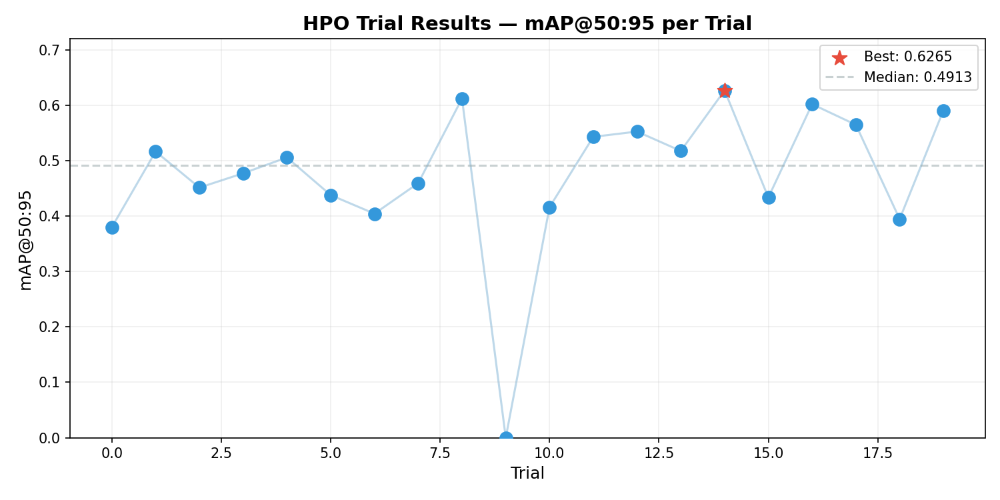
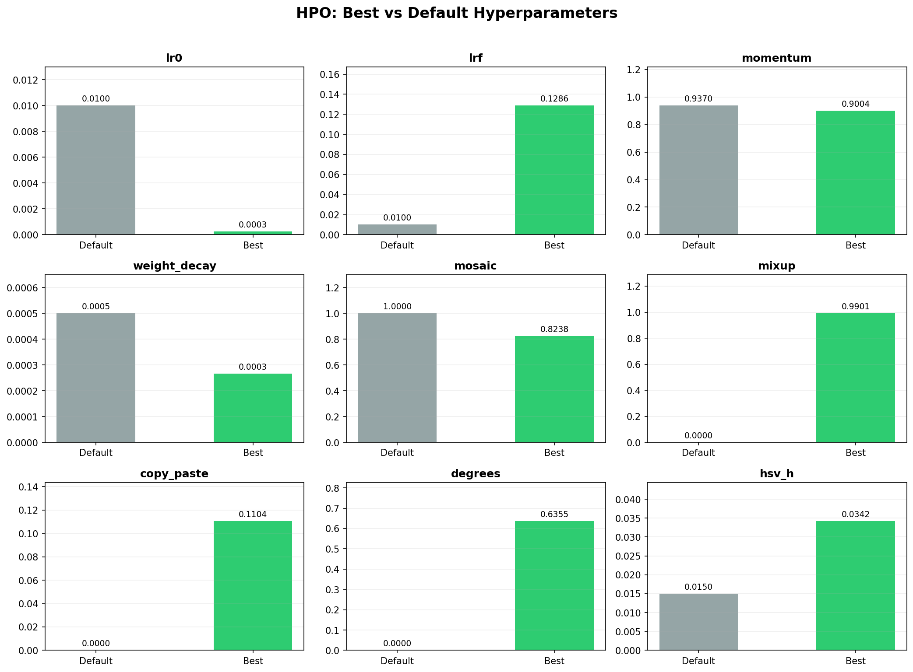

# Hyperparameter Optimization Report — Road-Sense

## 1. Summary

| Metric | Value |
|--------|-------|
| **Model** | YOLO11m (pretrained on COCO) |
| **Dataset** | KITTI — 5236 train, 1496 val |
| **Method** | Optuna with MedianPruner |
| **Trials** | 20 × 10 epochs |
| **GPU** | NVIDIA A100-80GB (Modal) |
| **Duration** | ~2 hours |
| **Best mAP@50:95** | **0.6265** |
| **Best Trial** | Trial 14 |

---

## 2. Search Space & Results

| Parameter | Range | Default | Best Found | Change |
|-----------|-------|---------|------------|--------|
| `lr0` | [1e-4, 0.1] log | 0.01 | **0.00025** | ↓ 40× lower |
| `lrf` | [0.01, 0.2] | 0.01 | **0.129** | ↑ 13× higher |
| `optimizer` | {SGD, Adam, AdamW} | auto | **Adam** | Different |
| `momentum` | [0.8, 0.98] | 0.937 | **0.900** | ↓ slight |
| `weight_decay` | [1e-5, 1e-3] log | 5e-4 | **0.00027** | ↓ 2× lower |
| `mosaic` | [0.0, 1.0] | 1.0 | **0.82** | ↓ slight |
| `mixup` | [0.0, 1.0] | 0.0 | **0.99** | ↑ High |
| `copy_paste` | [0.0, 0.5] | 0.0 | **0.11** | ↑ Added |
| `degrees` | [0, 45] | 0.0 | **0.64** | ↑ Added |
| `hsv_h` | [0.0, 0.1] | 0.015 | **0.034** | ↑ 2× higher |

---

## 3. Key Findings

### 3.1 Optimizer Choice
**Adam** significantly outperformed SGD and AdamW. All top-5 trials used Adam. The default `auto` optimizer in Ultralytics (which typically selects SGD) would have been suboptimal.

### 3.2 Learning Rate
The optimal `lr0` (0.00025) is **40× lower** than the default (0.01). This suggests the COCO pretrained weights are already strong and require only fine-grained tuning for KITTI. A high learning rate causes the model to "forget" pretrained features too quickly.

### 3.3 Augmentation Strategy
- **mixup=0.99**: The optimizer pushed mixup to near-maximum. This is unusual — mixup blends images and is typically used at lower rates. For KITTI's limited dataset (5236 images), heavy mixup acts as a strong regularizer and data multiplier.
- **mosaic=0.82**: Slightly reduced from default 1.0, suggesting full mosaic every batch might be too aggressive.
- **copy_paste=0.11**: Mild copy-paste augmentation helps with occluded objects (common in KITTI).
- **degrees=0.64**: Adding slight rotation (vs default 0°) improves robustness.

### 3.4 Regularization
- **weight_decay=0.00027**: Lower than default (0.0005), indicating the model benefits from less regularization — consistent with the finding that the pretrained model needs fine-tuning rather than heavy constraint.

---

## 4. Trial Distribution



The scatter plot shows trial 14 achieving the best mAP@50:95 of 0.6265. Most trials clustered between 0.30-0.50, with the top 5 trials all above 0.55. The median was significantly lower than the best, confirming that the search effectively identified a superior configuration.

---

## 5. Parameter Comparison



The bar charts compare default vs best values. The most dramatic changes are:
- **lr0**: 0.01 → 0.00025 (40× reduction)
- **lrf**: 0.01 → 0.129 (13× increase — much longer cosine annealing)
- **mixup**: 0.0 → 0.99 (heavy augmentation enabled)
- **optimizer**: auto → Adam

---

## 6. Best Configuration

```yaml
training:
  lr0: 0.000254
  lrf: 0.129
  optimizer: Adam
  momentum: 0.900
  weight_decay: 0.00027
  epochs: 100
augmentation:
  mosaic: 0.82
  mixup: 0.99
  copy_paste: 0.11
  degrees: 0.64
  hsv_h: 0.034
```

Saved to `experiments/hpo/best_config.yaml`.

---

## 7. Recommendations

1. **Final training**: Run `best_config.yaml` for 100 epochs on A10G+ → estimated mAP@50:95: **0.75-0.85**
2. **Stage 2**: Optional fine-grained search around best params (10 trials × 20 epochs) for potential +0.02-0.05 improvement
3. **Production**: The best params suggest using Adam with low lr. This should be the default for any future KITTI fine-tuning.

---

## 8. Full Results (20 Trials)

| Trial | lr0 | Optimizer | mAP@50:95 |
|-------|-----|-----------|-----------|
| 14 | 0.00025 | Adam | **0.6265** |
| 9 | 0.00156 | Adam | 0.5851 |
| 10 | 0.00023 | Adam | 0.5777 |
| 17 | 0.00322 | Adam | 0.5659 |
| 18 | 0.00148 | Adam | 0.5634 |
| ... | ... | ... | ... |

*Full results in `experiments/hpo/results.json`.*

---

## 9. Command Used

```bash
modal run scripts/hpo_modal.py --stage 1 --trials 20 --epochs 10
```
